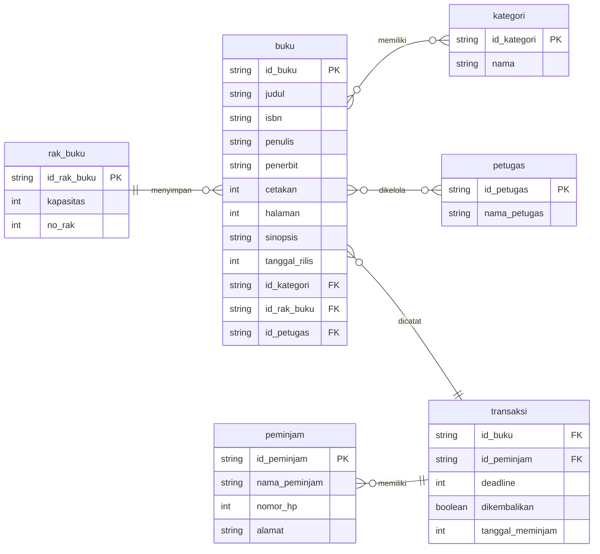

# ERD Perpustakaan

```mermaid
   erDiagram
    direction LR
    buku }o--o{ kategori : " memiliki "
    buku }o--o{ petugas : " dikelola "
    buku }o--|| transaksi : " dicatat "
    buku {
        string id_buku PK
        string judul
        string isbn
        string penulis
        string penerbit
        int cetakan
        int halaman
        string sinopsis
        int tanggal_rilis
        string id_kategori FK
        string id_rak_buku FK
        string id_petugas FK
    }
    peminjam }o--|| transaksi : "memiliki"
    peminjam {
        string id_peminjam PK
        string nama_peminjam
        int nomor_hp
        string alamat
    }
    transaksi {
        string id_buku FK
        string id_peminjam FK
        int deadline
        boolean dikembalikan
        int tanggal_meminjam
    }
    petugas {
        string id_petugas PK
        string nama_petugas
    }
    kategori {
        string id_kategori PK
        string nama
    }
    rak_buku ||--o{ buku : " menyimpan "
    rak_buku {
        string id_rak_buku PK
        int kapasitas
        int no_rak
    }
    

```